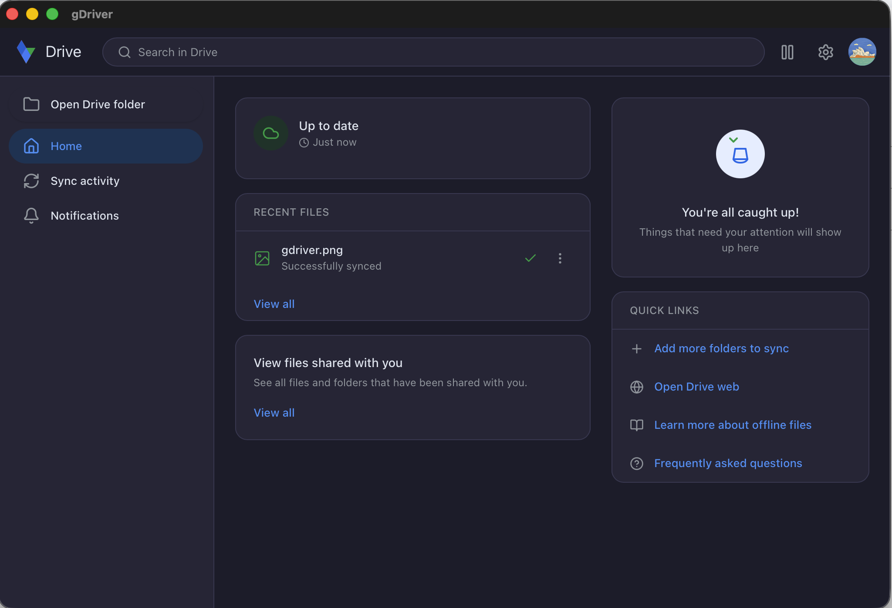
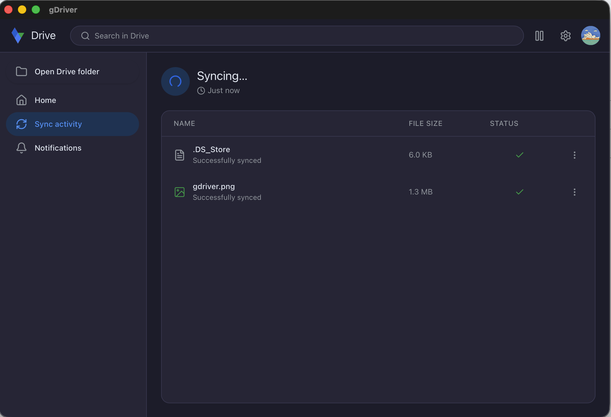
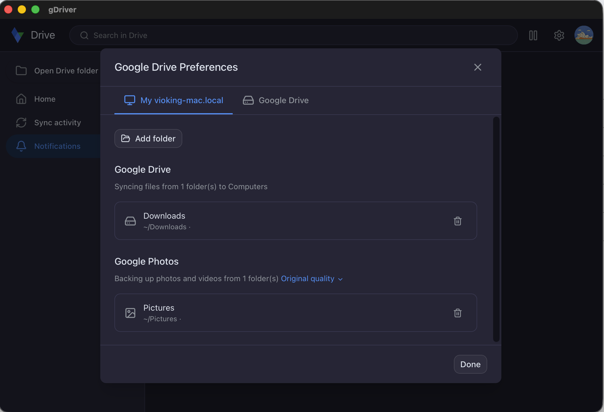

# gDriver

[](https://github.com/ViokingTung/gdriver/releases/latest)
[](https://tauri.app)
[](LICENSE)

Cross-platform Google Drive desktop client. Access Google Drive files directly from your file manager — no browser needed.

## Features

- **File Manager Integration** — Browse Drive files in Explorer (Windows), Finder (macOS), and Nautilus (Linux) with context menu actions
- **Selective Sync** — Choose which folders to sync locally; stream others on-demand via FUSE/virtual drive
- **Offline Access** — Mark files and folders as "available offline" with one click
- **Multi-Account** — Connect multiple Google accounts and manage them from a single tray menu
- **Conflict Resolution** — Detects edit conflicts and keeps both versions so you never lose work
- **System Tray** — Runs quietly in the background with sync status at a glance
- **Cross-Platform** — Native look and feel on Windows 10/11, macOS 12+, and Linux (Debian, Fedora, Arch)
- **Internationalization** — 12 languages supported (en, zh-CN, zh-TW, ja, ko, de, fr, es, pt-BR, ru, it, ar) with RTL support

## Screenshots

| Welcome | Home | Settings |
|---------|------|----------|
|  |  |  |

## Tech Stack

| Layer | Technology |
|-------|------------|
| Desktop shell | [Tauri v2](https://tauri.app) |
| Frontend | React 19 + TypeScript + Tailwind CSS 4 |
| Backend daemon | Rust (Tokio, SQLite, FUSE) |
| IPC | Unix domain sockets / Windows named pipes |
| Google APIs | REST + change notifications |
| Packaging | NSIS (.exe), DMG, .deb/.rpm/.AppImage |

## Architecture

gDriver follows a **daemon-app separation** model. The Tauri app is a thin UI shell; all business logic lives in a background daemon. They communicate via JSON-RPC 2.0 over Unix domain sockets (Linux/macOS) or named pipes (Windows). The app auto-spawns the daemon if it is not running.

```
┌─────────────────────────────────────────────────────────┐
│  Tauri App (UI Shell)                                   │
│  React + TypeScript ←→ Rust Commands ←→ DaemonClient    │
└────────────────────────┬────────────────────────────────┘
                         │ JSON-RPC 2.0 (socket / pipe)
┌────────────────────────▼────────────────────────────────┐
│  gdriver-daemon (Background Service)                    │
│  ┌──────────┐ ┌──────────┐ ┌──────────┐ ┌───────────┐  │
│  │   Sync   │ │    VFS   │ │  Watcher │ │    IPC    │  │
│  │  Engine  │ │ (FUSE/   │ │ (local   │ │  Server   │  │
│  │          │ │  WinFSP) │ │  changes)│ │           │  │
│  └────┬─────┘ └────┬─────┘ └────┬─────┘ └─────┬─────┘  │
│       └────────────┼───────────┼──────────────┘         │
│              ┌─────▼───────────▼─────┐                  │
│              │   gdriver-api         │                  │
│              │ (Google Drive/Photos) │                  │
│              └───────────────────────┘                  │
└─────────────────────────────────────────────────────────┘
```

## Project Structure

```
gDriver/
├── apps/
│   └── gdriver-app/               # Tauri desktop app
│       ├── src/                    # React frontend (TypeScript)
│       │   ├── components/         # UI components (shadcn)
│       │   ├── routes/             # Pages (onboarding + main)
│       │   ├── store/              # Zustand state stores
│       │   ├── hooks/              # React hooks (daemon events, theme)
│       │   ├── i18n/               # 12 locale files
│       │   └── lib/                # Utilities
│       └── src-tauri/              # Rust backend (Tauri commands)
│           └── src/
│               ├── commands.rs     # 23 invoke commands
│               ├── daemon_client.rs # IPC client to daemon
│               ├── tray.rs         # System tray management
│               └── lib.rs          # App setup & plugin registration
├── crates/
│   ├── gdriver-daemon/             # Background service daemon (binary)
│   │   ├── src/
│   │   │   ├── main.rs             # Entry point & startup sequence
│   │   │   ├── api/                # Google API integration layer
│   │   │   ├── auth/               # OAuth token management
│   │   │   ├── config/             # TOML preferences
│   │   │   ├── db/                 # SQLite database layer
│   │   │   ├── ipc/                # JSON-RPC server (socket/pipe)
│   │   │   ├── platform/           # OS-specific (auto-start, etc.)
│   │   │   ├── sync/               # Sync orchestration
│   │   │   ├── vfs/                # VFS mount management
│   │   │   └── watcher/            # Local filesystem watcher
│   │   └── migrations/             # SQLite migrations
│   ├── gdriver-sync/               # Sync engine library
│   │   └── src/
│   │       ├── engine.rs           # Sync state machine (Idle/Scanning/Syncing/Paused)
│   │       ├── conflict.rs         # Conflict detection & resolution
│   │       ├── downloader.rs       # File download operations
│   │       ├── uploader.rs         # File upload operations
│   │       └── queue.rs            # Sync task queue
│   ├── gdriver-vfs/                # Virtual filesystem abstraction
│   │   └── src/
│   │       ├── backend.rs          # VfsBackend trait
│   │       ├── db.rs               # Metadata from SQLite
│   │       ├── linux.rs            # FUSE implementation
│   │       ├── macos.rs            # FUSE (libfuse) implementation
│   │       └── windows.rs          # WinFSP implementation
│   ├── gdriver-api/                # Google Drive & Photos API client
│   │   └── src/
│   │       ├── auth.rs             # OAuth2 PKCE flow
│   │       ├── client.rs           # DriveClient with token refresh
│   │       ├── files.rs            # File listing & operations
│   │       ├── changes.rs          # Changes feed polling
│   │       └── photos.rs           # Google Photos backup
│   └── gdriver-ipc/                # Shared IPC protocol types
│       └── src/
│           ├── methods.rs          # JSON-RPC method constants
│           ├── types.rs            # Shared data types
│           └── client.rs           # JSON-RPC client helpers
├── extensions/
│   ├── nautilus/                   # Linux: GNOME Files (Python)
│   ├── dolphin/                    # Linux: KDE Dolphin (Python)
│   ├── thunar/                     # Linux: XFCE Thunar (placeholder)
│   ├── findersync/                 # macOS: Finder Sync (Swift)
│   ├── fileprovider/               # macOS: File Provider (Swift)
│   └── windows-shell/              # Windows: Explorer Shell (Rust COM)
├── packaging/
│   ├── linux/                      # .deb / .rpm / .AppImage build scripts
│   ├── macos/                      # .dmg build, signing, notarization
│   └── windows/                    # NSIS / MSI build, code signing
├── docs/                           # Design docs, plan, requirements
└── imgs/                           # App screenshots
```

## Packages & Crates

### Rust Crates

| Crate | Type | Description |
|-------|------|-------------|
| **gdriver-daemon** | Binary | Background sync daemon. Manages SQLite database, IPC server, sync engine, VFS mount, filesystem watcher, and platform-specific auto-start. This is the core service that runs continuously. |
| **gdriver-sync** | Library | Sync engine library. Implements the sync state machine (Idle/Scanning/Syncing/Paused), conflict detection/resolution, upload/download operations, and task queue management. Separated from daemon for isolated unit testing. |
| **gdriver-vfs** | Library | Virtual filesystem abstraction. Exposes Drive files as a native mount via FUSE (Linux/macOS) or WinFSP (Windows). Defines the `VfsBackend` trait with platform-specific implementations. |
| **gdriver-api** | Library | Google Drive v3 and Photos API client. Handles OAuth2 PKCE authentication, file listing, changes feed polling, file download/upload streams. Includes automatic 401 token recovery. |
| **gdriver-ipc** | Library | Shared IPC protocol types. Defines the complete JSON-RPC 2.0 protocol (methods, types, serialization) used between all components. Pure data types with no async runtime dependency. |

### Frontend

| Package | Description |
|---------|-------------|
| **gdriver-app** (frontend) | React 19 + TypeScript + Tailwind CSS 4 frontend. Two-phase UI: 8-step onboarding flow and main dashboard. Uses Zustand for state, TanStack Query for data fetching, i18next for i18n, and shadcn components. |

### File Manager Extensions

| Extension | Platform | Language | Description |
|-----------|----------|----------|-------------|
| **nautilus** | Linux (GNOME) | Python | Nautilus extension showing sync state emblems and Drive context menu actions. Connects to daemon via Unix socket. |
| **dolphin** | Linux (KDE) | Python | Dolphin service menu integration with IPC client (same protocol as Nautilus). |
| **findersync** | macOS | Swift | Finder Sync extension for badge overlays and context menu actions. |
| **fileprovider** | macOS | Swift | File Provider extension for Finder integration and on-demand file access. |
| **windows-shell** | Windows | Rust (COM) | Explorer shell extension for icon overlays and context menu. Registers as a COM server. |

## Prerequisites

- **Rust** 1.80+ (install via [rustup](https://rustup.rs))
- **Node.js** 20+ and **pnpm** 9+
- **Linux**: `libwebkit2gtk-4.1-dev`, `libgtk-3-dev`, `libfuse3-dev`, `libssl-dev`
- **macOS**: Xcode 15+ (for Swift extensions)
- **Windows**: Visual Studio 2022 Build Tools, Windows SDK 10.0.22621+

## Quick Start

```bash
# Clone and install dependencies
git clone https://github.com/gdriver/gdriver.git
cd gdriver
pnpm install

# Copy and configure environment variables
cp .env.example .env
# Edit .env with your Google OAuth credentials (see Configuration below)

# Start development mode (Vite dev server + Tauri window)
pnpm dev
```

The `pnpm dev` command starts the Vite frontend dev server on port 1420 with HMR on port 1421, then launches the Tauri window which auto-spawns the daemon.

## Configuration

### Google OAuth Credentials

1. Create OAuth 2.0 credentials at the [Google Cloud Console](https://console.cloud.google.com/apis/credentials)
2. Copy `.env.example` to `.env` and fill in your credentials:

```bash
GOOGLE_CLIENT_ID=your_client_id_here
GOOGLE_CLIENT_SECRET=your_client_secret_here
```

### Environment Variables

| Variable | Required | Description |
|----------|----------|-------------|
| `GOOGLE_CLIENT_ID` | Yes | Google OAuth 2.0 client ID |
| `GOOGLE_CLIENT_SECRET` | Yes | Google OAuth 2.0 client secret |
| `DATABASE_URL` | No | SQLite path for sqlx-cli offline checks (default: `sqlite:gdriver.db?mode=rwc`) |
| `RUST_LOG` | No | Log level filter (e.g. `gdriver_daemon=debug,gdriver_sync=debug`) |

### Runtime Configuration

The daemon stores its preferences as TOML at a platform-specific path:

| Platform | Path |
|----------|------|
| Linux | `~/.local/share/gdriver/preferences.toml` |
| macOS | `~/Library/Application Support/gdriver/preferences.toml` |
| Windows | `%APPDATA%\gdriver\preferences.toml` |

Database location follows the same pattern with `gdriver.db`.

## Development

### Workspace Layout

This project uses a **dual workspace** model:

- **pnpm workspace**: manages JavaScript/TypeScript packages (`apps/*`)
- **Cargo workspace**: manages Rust crates (`crates/*`, `apps/*/src-tauri`)

### Running in Development

```bash
# Full app (frontend + Tauri + daemon) — recommended
pnpm dev

# Frontend only (useful for UI development without native window)
cd apps/gdriver-app && pnpm dev

# Daemon only (useful for backend/IPC debugging)
cargo run -p gdriver-daemon

# Run with debug logging
RUST_LOG=gdriver_daemon=debug,gdriver_sync=debug cargo run -p gdriver-daemon
```

### Building

```bash
# Build frontend
pnpm build

# Build all Rust crates (debug)
cargo build

# Build all Rust crates (release, with LTO and stripping)
cargo build --release

# Build only the daemon
cargo build -p gdriver-daemon --release

# Build only the Tauri app
cargo build -p gdriver --release
```

### Linting & Formatting

```bash
# TypeScript lint
pnpm lint

# TypeScript format
pnpm format

# Rust format
cargo fmt

# Rust lint
cargo clippy -- -D warnings

# Run frontend tests
cd apps/gdriver-app && pnpm test
```

### Sync Modes

The daemon supports two sync modes that can be switched at runtime:

- **Stream** — Files are cloud-only by default and downloaded on-demand when accessed via the VFS mount
- **Mirror** — Entire selected Drive folders are downloaded locally and kept in sync

## Building Platform Packages

### Linux

```bash
# .deb for Debian/Ubuntu
bash packaging/linux/build.sh deb

# .rpm for Fedora/RHEL
bash packaging/linux/build.sh rpm

# .AppImage for any Linux
bash packaging/linux/build.sh appimage
```

The Linux packages install:
- `gdriver-daemon` to `/usr/bin/`
- Nautilus and Dolphin extensions to system paths
- Post-install scripts register extensions and start the daemon

### macOS

```bash
# .dmg (non-signed)
bash packaging/macos/build.sh

# Signed + notarized .dmg
bash packaging/macos/build.sh --sign --notarize
```

Before signing, configure `packaging/macos/sign-config.sh` with your Apple Team ID, Apple ID, and app-specific password.

The macOS DMG includes:
- The Tauri app bundle with daemon embedded at `Contents/MacOS/`
- FinderSync extension (`.appex`) for Finder badge overlays
- FileProvider extension (`.appex`) for on-demand file access
- Universal binary (x86_64 + arm64)

### Windows

```powershell
# NSIS installer
.\packaging\windows\build.ps1 -BuildMode nsis

# MSI installer (WiX)
.\packaging\windows\build.ps1 -BuildMode msi
```

Before code signing, configure `packaging\windows\signing\sign-config.json` with your certificate details.

The Windows installer registers:
- The daemon as a background service
- Shell extension DLL for Explorer integration

## CI/CD

### Continuous Integration

On push/PR to `main`:
1. **Rust Check (Linux)** — `cargo fmt`, `clippy`, build, test
2. **TypeScript Check** — type-check, lint, build frontend, Vitest
3. **Rust Check (Windows)** — build workspace + shell extension
4. **Rust Check (macOS)** — build workspace + Swift extensions

### Release

Triggered on `v*` tags. Builds all platform packages in parallel:

1. Linux: `.deb`, `.rpm`, `.AppImage` with SHA-256 checksums
2. Windows: NSIS installer with code signing
3. macOS: Universal `.dmg` with signing and notarization
4. Creates GitHub Release with all artifacts and combined `SHA256SUMS`

```bash
# Trigger a release
git tag v0.1.0
git push origin v0.1.0
```

## Contributing

See [CONTRIBUTING.md](CONTRIBUTING.md) for development setup, coding conventions, and pull request guidelines.

## Documentation

- [Requirements](docs/requirement.md)
- [Design](docs/design.md)
- [Development Plan](docs/plan.md)
- [Release Checklist](docs/RELEASE_CHECKLIST.md)

## License

[Apache-2.0](LICENSE)
